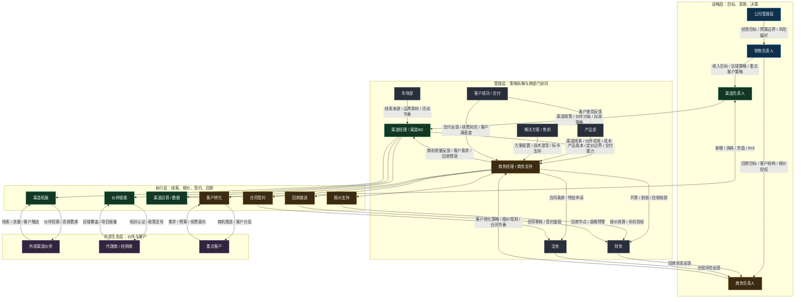
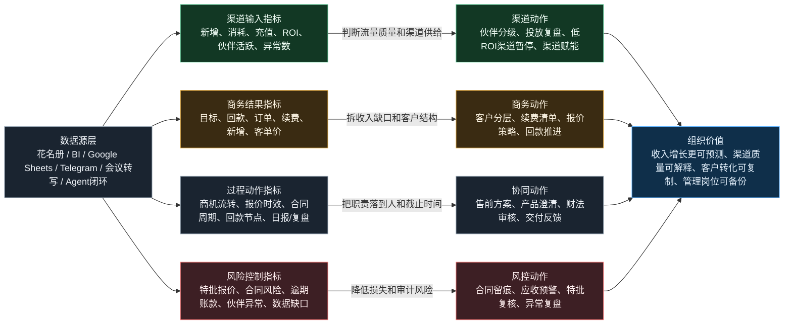

# 渠道与商务管理岗位分析材料

生成时间：2026-05-07 18:47

## 总体设计思路

这套材料围绕“岗位职责-协同关系-业务动作-指标结果-组织价值”展开。它不是组织架构图，也不是HR能力模型，而是把渠道供给、商务转化、报价合同、回款风控、客户经营和备岗培养放在同一套管理语言里。

## 模块1：上下游关系图

## 模块2：指标、业务、价值逻辑图

## 模块3：备岗人员能力差距评估表

评分规则：1不了解，2需要指导，3独立常规任务，4复杂场景并带教，5制定体系并影响团队结果。
差距得分 = 权重 x Max(目标等级 - 当前等级, 0)。

